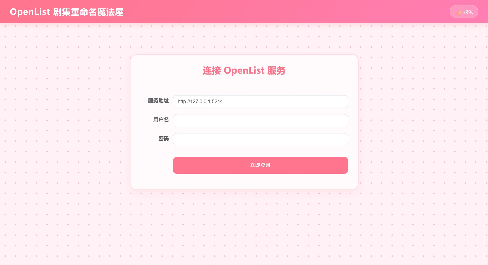
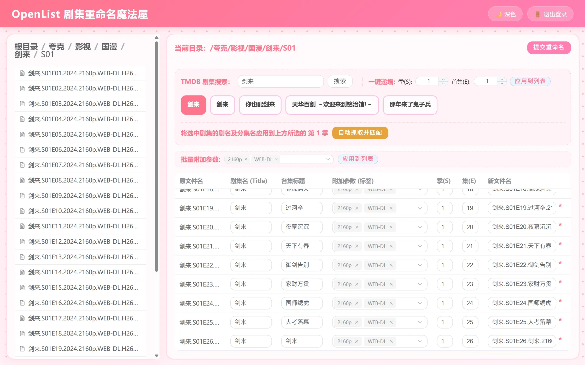

# OpenList Episode Rename

一个集 Web UI 与命令行于一体的 OpenList 剧集批量重命名工具，支持 TMDB 剧集信息自动抓取、深色/浅色主题切换、目录重命名等。

# 预览图




## 项目结构

```
openlist_episode_rename/
├── core.py              # 核心重命名逻辑（OpenList API 封装、剧集识别、重命名引擎）
├── server.py            # FastAPI Web 服务端
├── cli.py               # Rich 命令行交互界面
├── frontend/
│   └── index.html       # Vue 3 + Element Plus 前端页面
├── .github/workflows/   # CI/CD 自动发布
├── .gitignore
├── LICENSE
└── README.md
```

## 功能特性

### Web UI

- **玻璃拟态界面** — 半透明毛玻璃卡片，支持深色/浅色一键切换
- **目录浏览与重命名** — 侧边栏树形导航，点击目录进入，支持直接重命名目录
- **批量重命名** — 一键递增季(S)/集(E)编号，批量附加标签参数
- **TMDB 集成** — 搜索剧集后自动抓取分集名称并匹配到文件列表
- **单集编辑** — 逐一手动调整每个文件的目标名称
- **登录持久化** — 登录信息保存到 localStorage，刷新不丢失

### 命令行 (CLI)

- 基于 Rich 的美化终端界面
- 交互式目录导航
- 智能/手动/统一/正则四种重命名模式

## 快速开始

### 安装依赖

```bash
pip install requests fastapi uvicorn beautifulsoup4 rich
```

### 启动 Web 服务

```bash
python server.py
```

浏览器打开 `http://127.0.0.1:8000`，输入 OpenList 服务地址、用户名和密码即可登录使用。

### 启动命令行工具

```bash
python cli.py
```

## 使用说明

1. **登录** — 在 Web UI 输入 OpenList 服务地址和账号密码；CLI 交互式输入
2. **导航** — 侧边栏点击目录进入，面包屑导航快速跳转
3. **重命名** — 勾选文件后，使用 TMDB 搜索或手动编辑目标名称，点击"批量重命名"执行
4. **目录重命名** — 侧边栏目录行右侧点击「重命名」按钮
5. **主题切换** — 头部右上角 🌙/☀️ 按钮切换深色/浅色模式

## 依赖

| 依赖                 | 用途          |
| -------------------- | ------------- |
| FastAPI + Uvicorn    | Web 服务框架  |
| Vue 3 + Element Plus | 前端 UI       |
| BeautifulSoup4       | TMDB 页面解析 |
| Rich                 | CLI 终端美化  |
| requests             | HTTP 请求     |

## 许可证

MIT License
